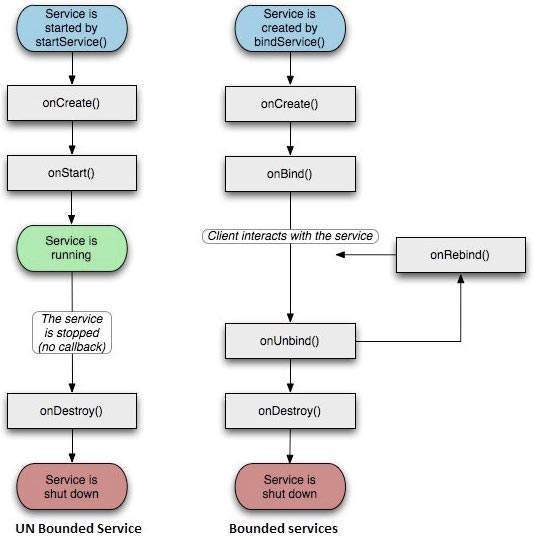

# Services

> Service là một thành phần chạy ở background để xử lý những công việc dài hạn như: phát một bài nhạc ở background trong khi người dùng đang sử dụng một ứng dụng khác, hoặc có thể là lấy dữ liệu thông qua mạng internet mà không tạm hoãn các hoạt động tương tác hiện tại của người dùng trên Activity.

| No | State | Description |
|----|---------|-------------|
| 1 | Started | Là một dạng service được start từ Application component, ví dụ: activity, gọi hàm startService() để bắt đầu run một service. Sau khi được start, một service có thể chạy ở background vô thời hạn, thậm chí component gọi lệnh run nó bị destroy thì nó vẫn chạy. |
| 2 | Bound | Là một dạng service bị ràng buộc với application component gọi hàm bindService() để start nó. Một bound service đóng vai trò như client-server, điều này cho phép các component tương tác với service, gửi các yêu cầu, nhận các kết quả và thập chí có thể giao tiếp qua các process khác. (giao tiếp liên tiến trình)

## Service Lifecycle

Here is a summary of the Service Lifecycle:

### onStartCommand()

> The system calls this method when another component, such as an activity, requests that the service be started, by calling startService(). If you implement this method, it is your responsibility to stop the service when its work is done, by calling stopSelf() or stopService() methods.

### onBind()

> The system calls this method when another component wants to bind with the service by calling bindService(). If you implement this method, you must provide an interface that clients use to communicate with the service, by returning an IBinder object. You must always implement this method, but if you don't want to allow binding, then you should return null.

### onUnbind()

> The system calls this method when all clients have disconnected from a particular interface published by the service.

### onRebind()

> The system calls this method when new clients have connected to the service, after it had previously been notified that all had disconnected in its onUnbind(Intent).

### onCreate()

> The system calls this method when the service is first created using onStartCommand() or onBind(). This call is required to perform one-time set-up.

### onDestroy()

> The system calls this method when the service is no longer used and is being destroyed. Your service should implement this to clean up any resources such as threads, registered listeners, receivers, etc.
