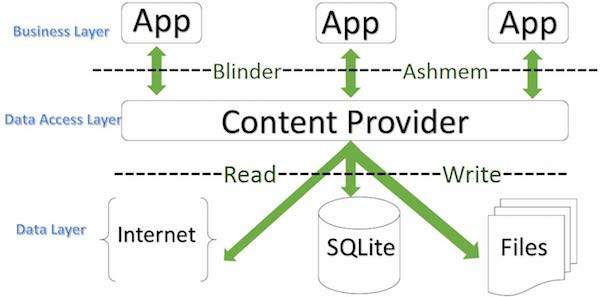

# Content Providers

> A content provider component supplies data from one application to others on request. Such requests are handled by the methods of the ContentResolver class. A content provider can use different ways to store its data and the data can be stored in a database, in files, or even over a network.

> sometimes it is required to share data across applications. This is where content providers become very useful.

