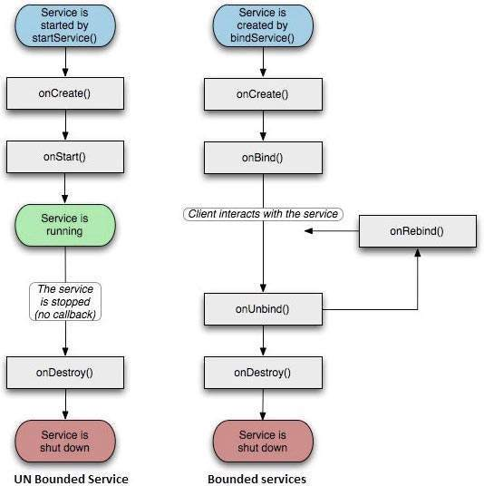

# Services

Original docs: [Android Developer Service Docs](https://developer.android.com/reference/kotlin/android/app/Service "Service")

> A service is a component that runs in the background to perform long-running operations without needing to interact with the user and it works even if application is destroyed. A service can essentially take two states.

| No | State | Description |
|----|---------|-------------|
| 1 | **Started** | A service is started when an application component, such as an activity, starts it by calling startService(). Once started, a service can run in the background indefinitely, even if the component that started it is destroyed. |
| 2 | **Bound** | A service is bound when an application component binds to it by calling bindService(). A bound service offers a client-server interface that allows components to interact with the service, send requests, get results, and even do so across processes with interprocess communication (IPC).

<P style="page-break-before: always">




<P style="page-break-before: always">


## Service Lifecycle

Here is a summary of the Service Lifecycle:

### onStartCommand()

> The system calls this method when another component, such as an activity, requests that the service be started, by calling startService(). If you implement this method, it is your responsibility to stop the service when its work is done, by calling stopSelf() or stopService() methods.

### onBind()

> The system calls this method when another component wants to bind with the service by calling bindService(). If you implement this method, you must provide an interface that clients use to communicate with the service, by returning an IBinder object. You must always implement this method, but if you don't want to allow binding, then you should return null.

### onUnbind()

> The system calls this method when all clients have disconnected from a particular interface published by the service.

### onRebind()

> The system calls this method when new clients have connected to the service, after it had previously been notified that all had disconnected in its onUnbind(Intent).

### onCreate()

> The system calls this method when the service is first created using onStartCommand() or onBind(). This call is required to perform one-time set-up.

### onDestroy()

> The system calls this method when the service is no longer used and is being destroyed. Your service should implement this to clean up any resources such as threads, registered listeners, receivers, etc.

<P style="page-break-before: always">


### Code

``` Kotlin
#kotlin
class LifecycleService : Service() {

    // indicates how to behave if the service is killed
    var mStartMode: Int = 0

    // interface for clients that bind
    var mBinder: IBinder? = null

    // indicates whether onRebind should be used
    var mAllowRebind: Boolean = false

    // Called when the service is being created.
    override fun onCreate() {
        super.onCreate()
    }

    // The service is starting, due to a call to startService()
    override fun onStartCommand(
        intent: Intent?,
        flags: Int,
        startId: Int): Int {
        return mStartMode
    }

    // A client is binding to the service with bindService()
    override fun onBind(intent: Intent?): IBinder? {
        return mBinder
    }

    // Called when all clients have unbound with unbindService()
    override fun onUnbind(intent: Intent?): Boolean {
        return mAllowRebind
    }

    // Called when a client is binding to the service with bindService()
    override fun onRebind(intent: Intent?) {

    }

    // Called when The service is no longer used and is being destroyed
    override fun onDestroy() {
        super.onDestroy()
    }
}
```
