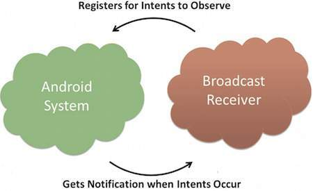

# Broadcast Receivers

Original docs: [Android Developer Service Docs](https://developer.android.com/reference/kotlin/android/content/BroadcastReceiver.html "BroadcastReceiver")

> Broadcast Receivers simply respond to broadcast messages from other applications or from the system itself. These messages are sometime called events or intents. For example, applications can also initiate broadcasts to let other applications know that some data has been downloaded to the device and is available for them to use, so this is broadcast receiver who will intercept this communication and will initiate appropriate action.

There are following two important steps to make BroadcastReceiver works for the system broadcasted intents.

- Creating the Broadcast Receiver.
- Registering Broadcast Receiver.

## Creating the Broadcast Receiver

A broadcast receiver is implemented as a subclass of BroadcastReceiver class and overriding the **onReceive()** method where each message is received as a Intent object parameter.

``` Java
# Java
public class MyReceiver extends BroadcastReceiver {
  @Override
  public void onReceive(Context context, Intent intent) {
    Toast.makeText(context, "Intent Detected.", Toast.LENGTH_LONG).show();
  }
}
```

``` Kotlin
# Kotlin
class MyReceiver L BroadcastReceiver {
  override fun onReceive(context: Context?, intent: Intent?) {
    Toast.makeText(context, "Intent Detected.", Toast.LENGTH_LONG).show()
  }
}
```

<P style="page-break-before: always">


## Registering Broadcast Receiver

An application listens for specific broadcast intents by registering a broadcast receiver in AndroidManifest.xml file. Consider we are going to register MyReceiver for system generated event ACTION_BOOT_COMPLETED which is fired by the system once the Android system has completed the boot process.



Now whenever your Android device gets booted, it will be intercepted by BroadcastReceiver MyReceiver and implemented logic inside onReceive() will be executed.

There are several system generated events defined as final static fields in the Intent class. The following table lists a few important system events.

| No | Event Constant | Description |
| -- | -------------- | -------------|
| 1 | **android.intent.action.BATTERY_CHANGED** | Sticky broadcast containing the charging state, level, and other information about the battery. |
| 2 | **android.intent.action.BATTERY_LOW** | Indicates low battery condition on the device. |
| 3 | **android.intent.action.BATTERY_OKAY** | Indicates the battery is now okay after being low. |
| 4 | **android.intent.action.BOOT_COMPLETED** | This is broadcast once, after the system has finished booting. |
| 5 | **android.intent.action.BUG_REPORT** | Show activity for reporting a bug. |
| 6 | **android.intent.action.CALL** | Perform a call to someone specified by the data. |
| 7 | **android.intent.action.CALL_BUTTON** | The user pressed the "call" button to go to the dialer or other appropriate UI for placing a call. |
| 8 | **android.intent.action.DATE_CHANGED** | The date has changed. |
| 9 | **android.intent.action.REBOOT** | Have the device reboot. |
|...| .................. | ....................... |

<P style="page-break-before: always">


## Broadcasting Custom Intents

If you want your application itself should generate and send custom intents then you will have to create and send those intents by using the sendBroadcast() method inside your activity class. If you use the sendStickyBroadcast(Intent) method, the Intent is sticky, meaning the Intent you are sending stays around after the broadcast is complete.

``` Java
# Java
public void broadcastIntent(View view) {
   Intent intent = new Intent();
   intent.setAction("dev.nxonxon.CUSTOM_INTENT");
   sendBroadcast(intent);
}
```

``` Kotlin
# Kotlin
fun broadcastIntent(view View?) {
   val intent = Intent()
   intent.setAction("dev.nxonxon.CUSTOM_INTENT")
   sendBroadcast(intent)
}
```

This intent dev.nxonxon.CUSTOM_INTENT can also be registered in similar way as we have regsitered system generated intent.

``` XML
<application
   android:icon="@drawable/ic_launcher"
   android:label="@string/app_name"
   android:theme="@style/AppTheme" >
   <receiver android:name="MyReceiver">
    <intent-filter>
        <action android:name="dev.nxonxon.CUSTOM_INTENT">
        </action>
    </intent-filter>
  </receiver>
</application>
```
