# Common View

## TextView

Original docs: [TextView](https://developer.android.com/reference/kotlin/android/widget/TextView)

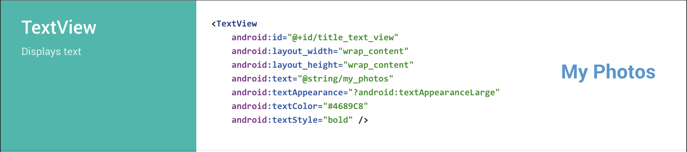

## EditText

Original docs: [EditText](https://developer.android.com/reference/kotlin/android/widget/EditText)

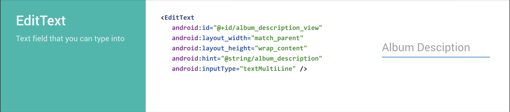

## Button

Original docs: [Button](https://developer.android.com/reference/kotlin/android/widget/Button)

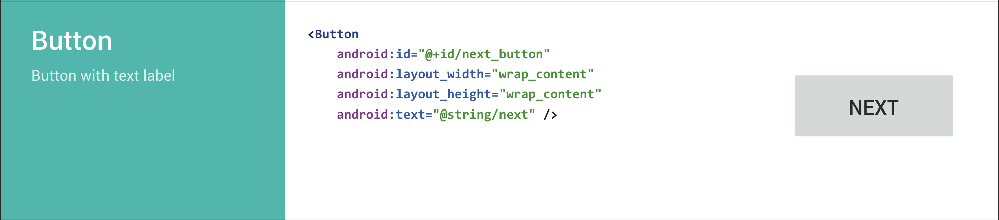

## ImageView

Original docs: [ImageView](https://developer.android.com/reference/kotlin/android/widget/ImageView)

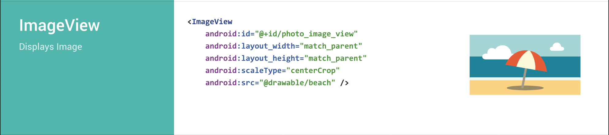

## View

Original docs: [View](https://developer.android.com/reference/kotlin/android/view/View)

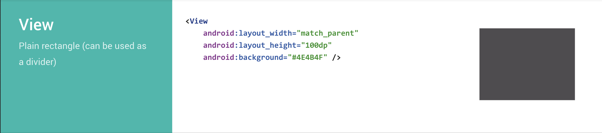

## CheckBox

Original docs: [CheckBox](https://developer.android.com/reference/kotlin/android/widget/CheckBox)

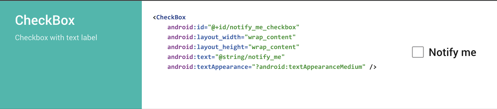

## RadioGroup - RadioButton

Original docs:

- [RadioGroup](https://developer.android.com/reference/kotlin/android/widget/RadioGroup)

- [RadioButton](https://developer.android.com/reference/kotlin/android/widget/RadioButton)

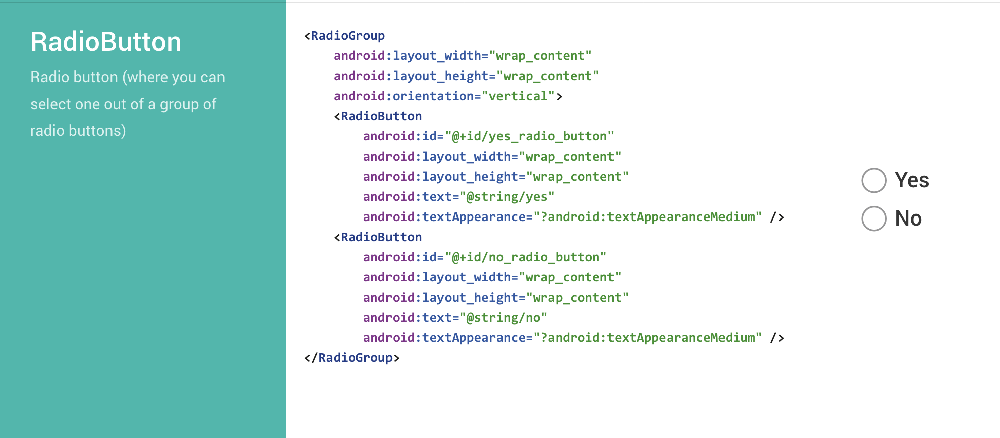

## RatingBar

Original docs: [RatingBar](https://developer.android.com/reference/kotlin/android/widget/RatingBar)

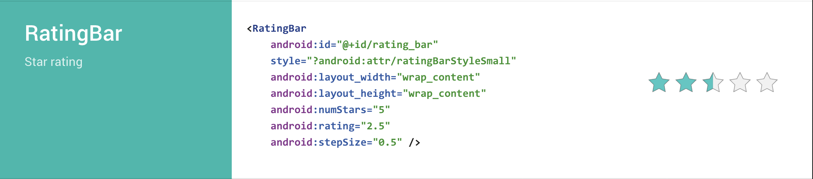

## Switch

Original docs: [Switch](https://developer.android.com/reference/kotlin/android/widget/Switch)

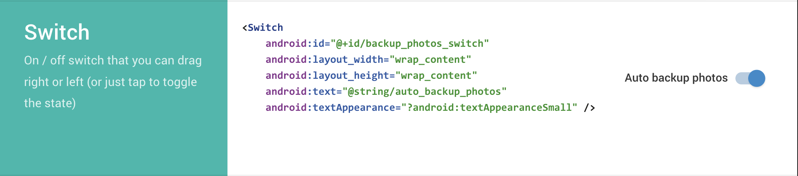

## SeekBar

Original docs: [SeekBar](https://developer.android.com/reference/kotlin/android/widget/SeekBar)

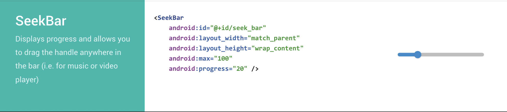

## SearchView

Original docs: [SearchView](https://developer.android.com/reference/kotlin/android/widget/SearchView)

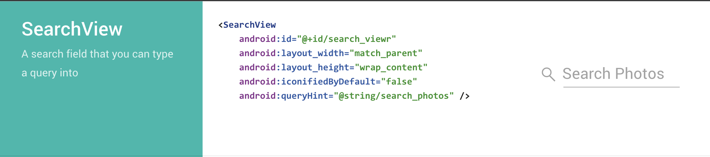

## ProgressBar

Original docs: [ProgressBar](https://developer.android.com/reference/kotlin/android/widget/ProgressBar)

### Spinner Loading Spinner

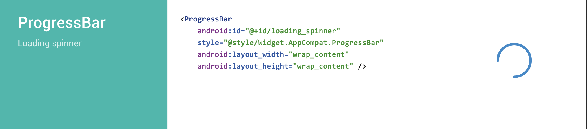

### Horizontal Loading Spinner

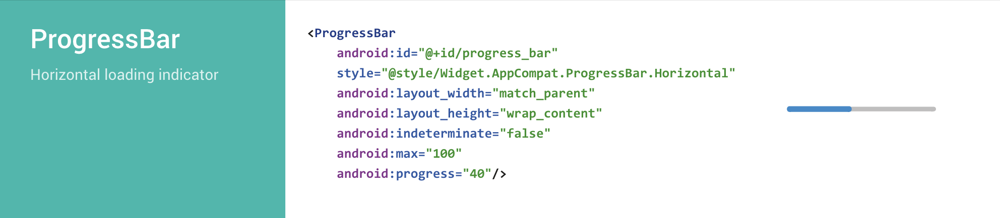
