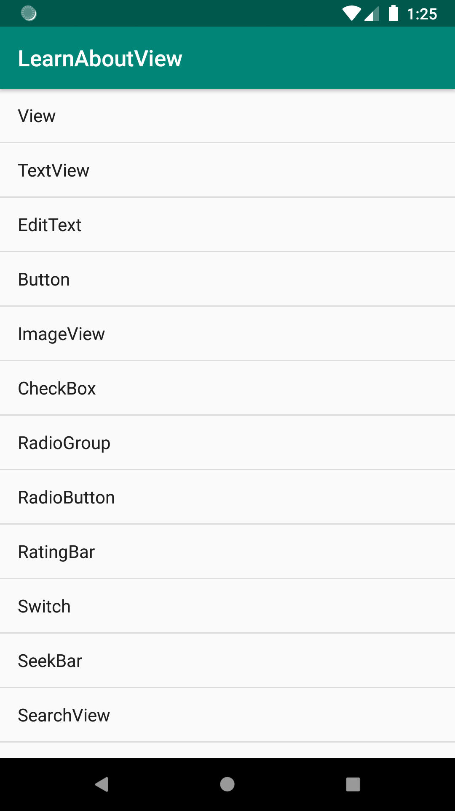

# ListView

Declare view in XML

``` XML
<ListView
        android:id="@+id/lvList"
        android:layout_width="match_parent"
        android:layout_height="match_parent"
        tools:listitem="@android:layout/simple_list_item_1" />
```

## Adapter

> We need a adapter to handle data, that is showed in item.

Basic:

- [BaseAdapter](https://developer.android.com/reference/kotlin/android/widget/BaseAdapter)
- [ArrayAdapter< T >](https://developer.android.com/reference/kotlin/android/widget/ArrayAdapter.html)

<P style="page-break-before: always">


## Example

``` kotlin
val items = arrayOf(
                "View",
                "TextView",
                "EditText",
                "Button",
                "ImageView",
                "CheckBox",
                "RadioGroup",
                "RadioButton",
                "RatingBar",
                "Switch",
                "SeekBar",
                "SearchView",
                "ProgressBar",
                "LinearLayout",
                "FrameLayout",
                "RelativeLayout",
                "ConstraintLayout",
                "ScrollView",
                "NestedScrollView",
                "ListView",
                "RecyclerView",
                "ExpandableListView").toList()
val listView = findViewById<ListView>(R.id.lvItem)
val itemAdapter = ArrayAdapter(this, android.R.layout.simple_list_item_1, items)
lvList.adapter = itemAdapter
```

<P style="page-break-before: always">



